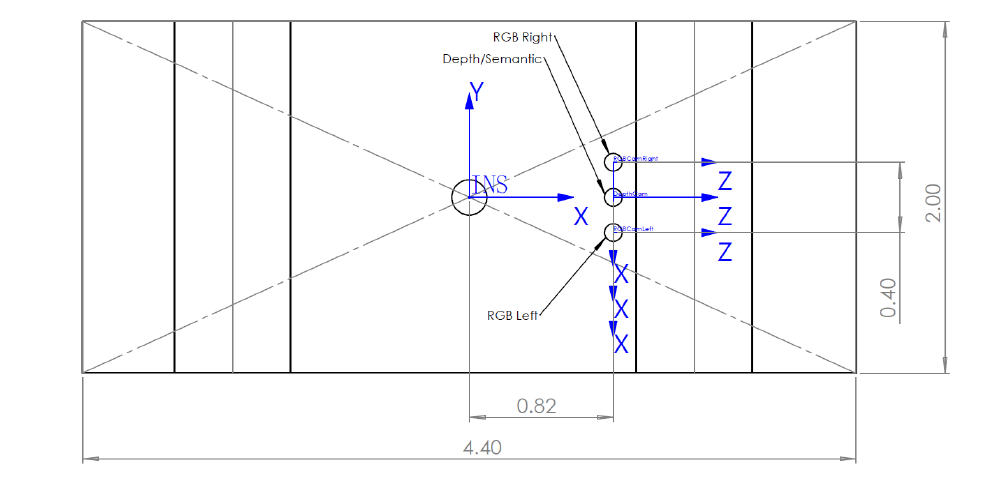

# ROS –Project **Autonomous Driving**

## 0  Description

This project primarily aims to achieve autonomous driving. A pre-set map contains numerous key points, and the vehicle must navigate according to the numbered sequence of these key points. During its journey, it must correctly identify traffic lights and stop at red lights. In addition, it must be able to identify and avoid other moving vehicles and obstacles.

---

## 1  Prerequisites

- **Ubuntu 20.04 LTS** (recommended)
- **ROS Noetic** — follow the official guide[1]


[1] [https://wiki.ros.org/noetic/Installation/Ubuntu](https://wiki.ros.org/noetic/Installation/Ubuntu)

---

## 2  System‑wide ROS packages

Install once via `apt` (they end up under `/opt/ros/noetic/...`).

```bash
sudo apt update
sudo apt install \
  ros-noetic-depth-image-proc ros-noetic-cv-bridge ros-noetic-image-transport \
  ros-noetic-octomap ros-noetic-octomap-msgs ros-noetic-octomap-ros \
  ros-noetic-move-base ros-noetic-navigation ros-noetic-octomap-rviz-plugins \
  ros-noetic-teb-local-planner
```

### 2.1  `octomap_mapping` (only if the *apt* package fails)

If you haven't make your catkin_ws, please do this at first:

```bash
mkdir -p ~/catkin_ws/src
cd ~/catkin_ws
catkin_make
```
Then do this to install octomap_mapping package:

```bash
cd ~/catkin_ws/src
git clone https://github.com/OctoMap/octomap_mapping.git
cd ~/catkin_ws
catkin_make_isolated --install
source ~/catkin_ws/install_isolated/setup.bash
```

Add your workspace to ROS_PACKAGE_PATH:

```bash
echo "source ~/catkin_ws/install_isolated/setup.bash" >> ~/.bashrc
source ~/.bashrc
```

Use following codes to check if it is installed correctly:

```bash
roscd octomap_mapping
roslaunch octomap_server octomap_mapping.launch
```

---

## 3  Python dependencies (installed **locally**)

All Python packages required by the perception stack are frozen in `project/requirements.txt`. Install them in one shot:

```bash
pip install --user -r requirements.txt     # installs into the user‑site packages
```

> **Optional – virtual environment**
>
> ```bash
> python3 -m venv .venv_yolo && source .venv_yolo/bin/activate
> pip install -r requirements.txt
> ```
>
> We **have not validated** the full pipeline inside an activated venv; extra steps (e.g. `catkin config -DPYTHON_EXECUTABLE=$(which python)` and a rebuild) are likely required.

---

## 4  Running the simulation & perception stack

At first you should build your work space:

```bash
catkin build                 # or `catkin_make`
```

Every new terminal that runs ROS nodes must source the overlay:

```bash
source ~/project/devel/setup.bash
```

Then run the launch file.

```bash
roslaunch simulation trial.launch
```

### 4.1  Selective testing via launch arguments

| Scenario               | Command                                                  |
| ---------------------- | -------------------------------------------------------- |
| **Navigation only**    | `roslaunch simulation trial.launch traffic_light:=false` |
| **Traffic‑light only** | `roslaunch simulation trial.launch auto_goals:=false`    |

---

## 5  Initial vehicle nudge

At startup the launch file **publishes a brief forward command** so that the planning frame (`OurCar/Center`) enters the cost‑map. Occasionally this automatic push fails; if the car remains idle, simply drive it forward in Unity by roughly one metre. Once the axle is inside the cost‑map, `move_base` will immediately take over.

## 6  Vehicle parameters




